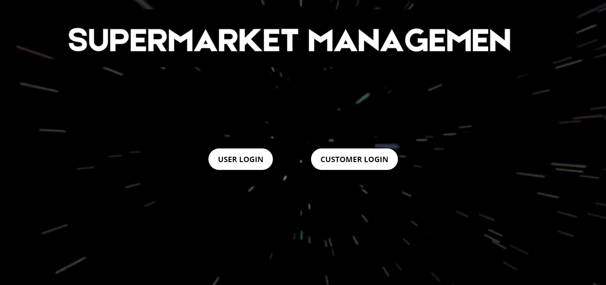
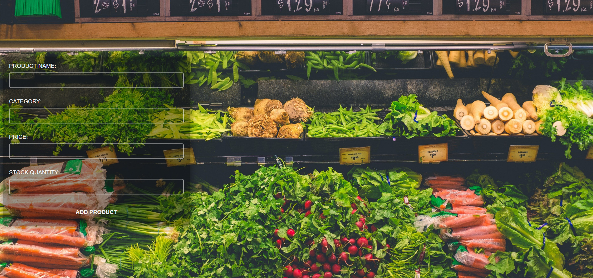

# 🛒 Supermarket Management System

The **Supermarket Management System (SMS)** is a complete and interactive software solution that manages the daily operations of a retail supermarket. It handles everything from product inventory and customer management to billing and stock monitoring, all through a simple and user-friendly interface.

This system is ideal for small to medium-sized supermarkets looking to move from manual processes to a digital, centralized platform for better accuracy, efficiency, and control.

## PREVIEW

